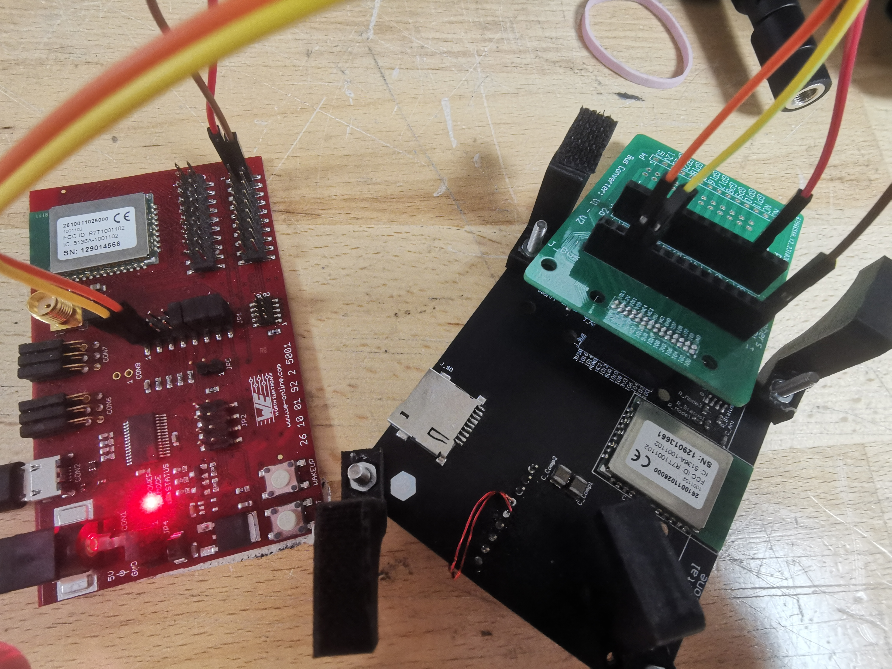

# Hardware Documentation
The board is build around the Calypso Wifi-module by Würth. This module transmits everything send to it via uard to a upd-receiver.
It also features a GPS module which doubles up as a time giver.

## Soldering
- Soldering doesn't require any additional knowledge.
- Be careful with the antenna as cold-soldering spots can cause a lot of trouble. And the Antenna may breakoff quite easily (use with adapter cable to reduce likelyhood).
- The two Buttons are as of now not required

## Programming
### BUS-Interface
This board uses a BUS-Interface for its logic. See the Software documentation for further references to that.
### Calypso Wifi-Module
The Calypso Wifi-Module needs to be programmed as well. This is a more complicated process described in the following.

- Datasheet Calypso: [Data Sheet](https://www.we-online.com/components/products/manual/UM_Calypso_261001102500x%20(rev2.5).pdf)
- Transparent Mode Datasheet: [Apendix](https://www.we-online.com/catalog/media/o677986v410%20ANR028_Calypso_TransparentMode.pdf)

The Calypso module is programmed via AT-commands send via uart.
In order for the module to be programmed it needs to be set into the programming mode. This can be done by following the datasheet and connecting the correct pins (Appmode1/2)or by using the Telematicsboard. You just need to use bridges on the pins (AppMode1/2) according to the diagram next to it, for programming this means connecting both pins to 0. 

Take one of the Calypso-Test-Boards. This will be used as an intermediate station to make this process easier. Connect it to you PC via USB. Then connect it as shown in the picture. (Needed: 4 cables Male to Female, 1 Bus Conveter, 2 BUs headers as they are on the Bus-Interface)

If you did everythin correctly you can now program it. This can in theory be done using any program that can write data to COM ports. But I recommed "hterm".
Be careful to use the correct uart settings. (can be found in the datasheet, or by loading the provided hterm settings file in this folder)
Commands for programming the module can also be found in the datasheet. The minimum required commands can also be easily found in the Transparent Mode Datasheet. Escpecially follow step 3.1.2 and "Code 9" in step 4.1.1..
Furthermore the transparent trigger is set to 2etx with etx set to oxFFFF. This makes it so that the module sends the udp message everytime we send a uart message. This is in theory inefficient, but was neccessary to remove data cut-offs that occured because of the max data limit of 1460bits.
